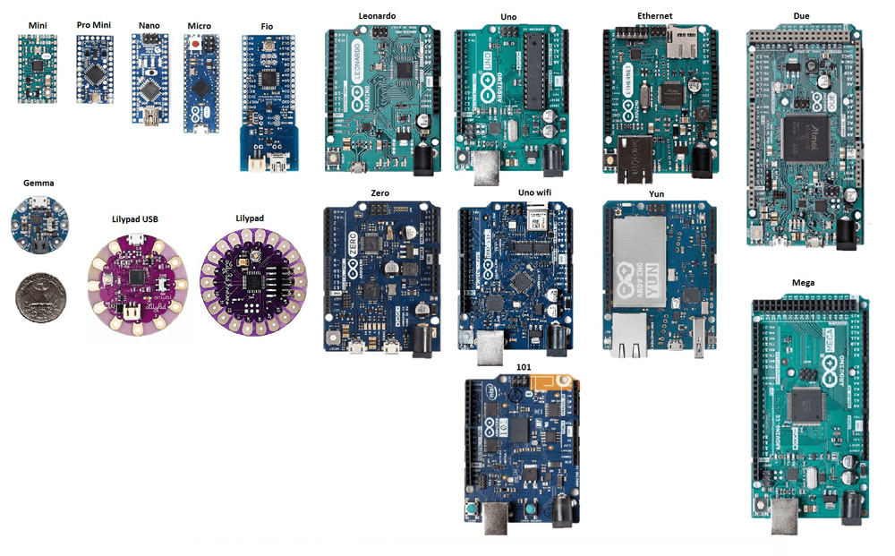

# Introduction to Arduino

https://github.com/user-attachments/assets/43b4e650-a094-42e8-9edb-2dd360985848



This module will introduce you to the basics of Arduino-based MCUs. Arduino is a powerful but beginner-friendly platform for building electronic projects. It is open-source and focussed on easy integration of hardware and software.

## The Arduino Platform
At it's core, Arduino consists of:
A range of programmable MCU boards with a range of Input/Output (I/O) functionalities for interacting with the real world, and,
An integrated development environment (the ) that runs on your computer and provides a place for you to write and upload code to your boards.

## Why Arduino?
Arduino is a natural place to begin when learning how to use microcontrollers. While not as powerful, integrated/compact, or robust as some industrial solutions, it provides 80% of these qualities with less than 20% of the complexity! 
Additionally, Arduino has become a defacto standard amongst makers, meaning that there is a wealth of documentation, tutorials, off-the-shelf software libraries, and compatible hardware available to support you as you are getting started.

 Important: Upon completion of this module, you will have a range of skills you can apply in your Arduino projects, and, when you're ready, extend to more sophisticated MCUs, like the STM32, commonly used in industrial prototyping.
## Applications
With Arduino, you can control lights, motors, sensors, and other hardware components to build  engineering solutions to real-world problems. The possibilities really are endless, for example:
Arduino is the perfect tool for prototyping robotic systems. With an Arduino MCU, you can ingest sensor data (e.g. distances using ultrasonics, or bumpers with switches), and drive motors and servos to move a robot around or actuate it's limbs.
You can also build your own smart home automations. For example, by reading data from motion sensors and microphones, you could build an automated lighting system that turns lights on when you enter a room and off when you leave, or responds to a clap! You could also build a smart watering system for your plants that responds to soil moisture!
Because some Arduino boards a very compact, they can also be used for wearables/biometrics. You could, for example, build your own fitness tracker that monitors a heart rate and counts steps, or a jacket with LEDs that light up in sync with your music.

## Arduino Hardware
A wide range of Arduino boards are available, and while they all function in essentially the same way, each is tailored for strength in a particular application. Note that  is essentially the same for all Arduino boards, and that tutorials for any one board can be applied to most others with no issues.

### Arduino UNO
The 'default' Arduino board - the UNO - strikes a balance between functionality and compactness, and is likely what you'll see used in most tutorial videos on the internet. Because it is the most common, it is also what features in Arduino simulators, like TinkerCAD. We will use TinkerCAD to show various examples throughout this module, and the Arduino UNO will feature in these.

### Arduino Mega
Some classes at Monash use the Arduino Mega - a physically larger MCU with a more expansive range of I/O pins. It is functionally an Arduino UNO on steroids, and most tutorials/images/gifs/simulations that apply to the UNO will equivalently apply to the Mega.

### Aftermarket/Third Party/Generic Boards
Because the Arduino hardware and software is open-source, there are many third-party/aftermarket "Arduino" boards available. Jaycar (a local electronics store) sells the "Duinotech" line, for example, and in many cases these aftermarket boards function exactly the same as the first-party ones, usually at a significantly reduced cost.

## Anatomy of an Arduino
The core features common to most Arduino boards are:
A USB connector for temporary power provision, loading programs and communicating with a computer over serial,
A DC Input Jack/Pin for in-situ power provision,
An onboard Voltage Regulator to buffer a steady input voltage to the board,
A range of Input/Output interface pins accessable via pin headers, and,
Onboard LEDs for:
Power On,
Serial Communications Active, and,
User-programmable control.

