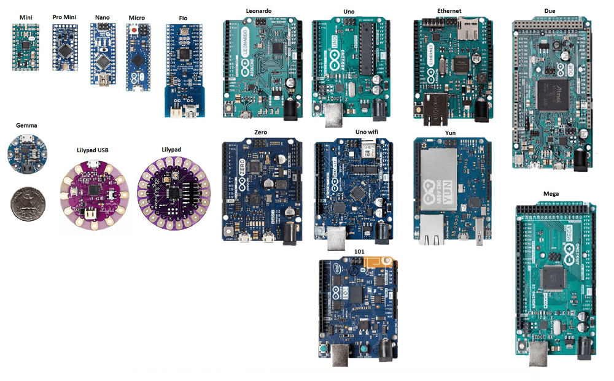

# :printer: 3D Printing Zero-to-Hero

<video controls src="../assets/3D PRINTING ZERO TO HERO/Welcome to 3D Printing Zero-to-Hero!.mp4"></video>

3D Printing is a revolutionary manufacturing technology that enables the production of complex, custom, and precise objects from digital 3D models. This manufacturing process is incredibly versatile and accessible, and is revolutionising industries ranging from healthcare to aerospace. 

3D printing is also a cornerstone of the emerging maker culture, democratising manufacturing, as it is now easier than ever to turn a concept into a physical part right from your home.

NU Teams extensively leverages 3D printing as a prototyping and manufacturing tool. From mounting sensors, to building electrical enclosures, to printing prototypes for test assemblies, 3D printing is probably our most-utilised manufacturing process.

## Learning Outcomes

In this short course, you'll learn about:

- [x] Printer hardware and the workings of a printer,

- [x] STLs and CAD export settings,

- [x] Slicing software and settings including:

    * [x] Layer Height,

    * [x] Orientation and supports,

    * [x] Shell thickness and infill.

- [x] Permanently joining your prints through glueing and welding,

- [x] Temporarily joining your prints using fasteners,

- [x] Designing tolerances for printed parts,

- [x] CAD principles for printed parts.

## Acknowledgements

!!! warning ":books: Resource:"

    This module was not created in a vacuum. Information was drawn, summarised, and refactored from a variety of sources - all of which are great review/summary/extension resources for the interested reader: 

    - The  website which has countless guides and articles about 3D printing,

    - The official Prusa website and YouTube channel,

    - Stefan Hermann's YouTube channel CNC Kitchen is home to many educational and experimental printing videos,

    - Angus Deveson's YouTube channel Maker's Muse also hosts many fantastic videos.

